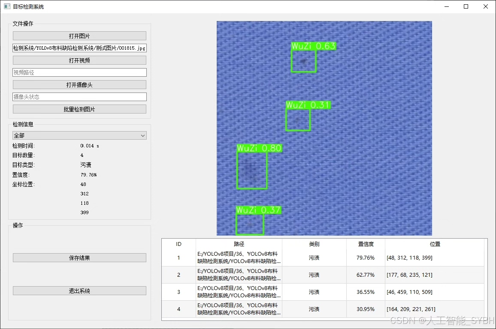
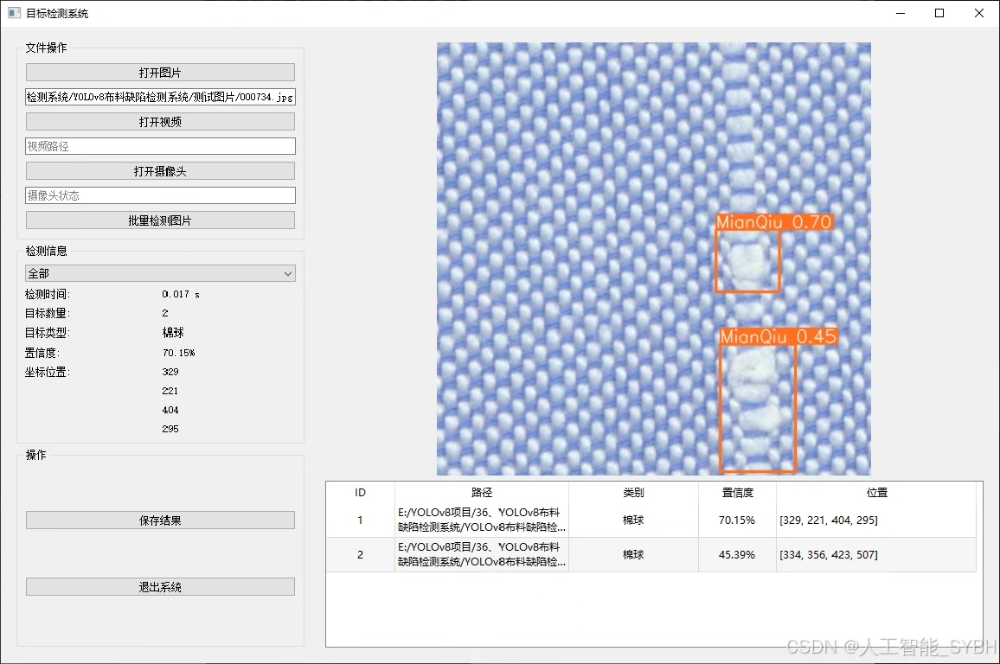
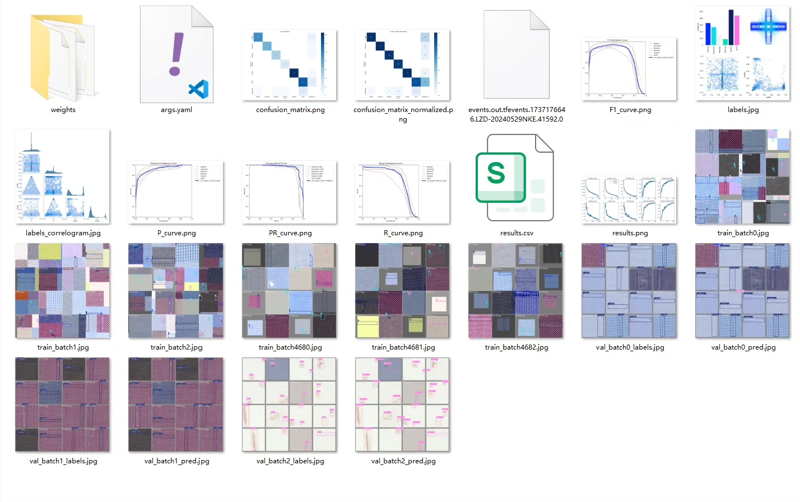
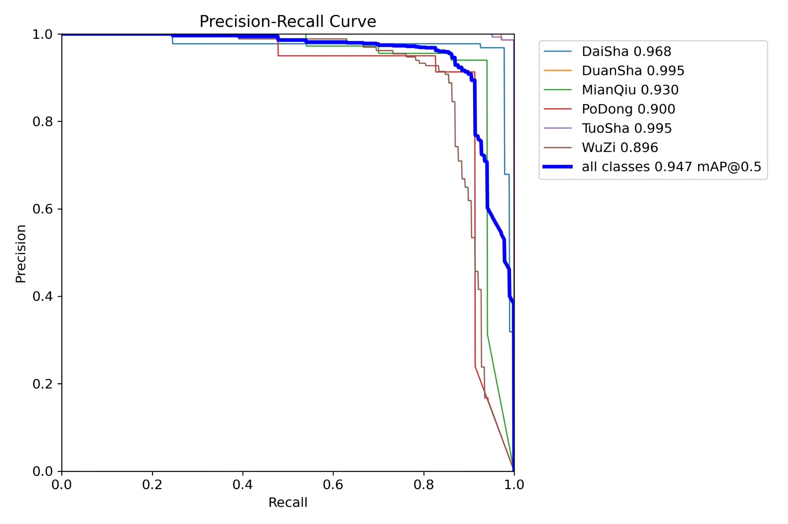
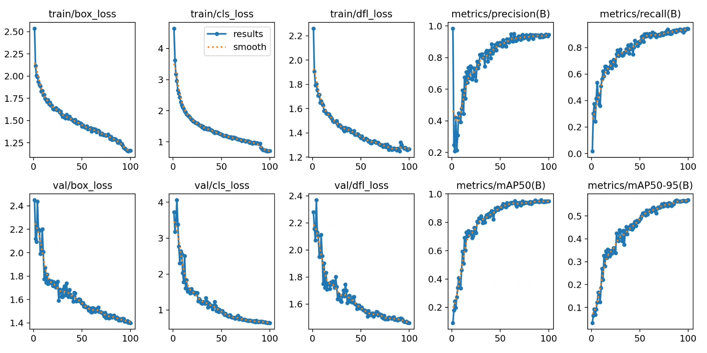
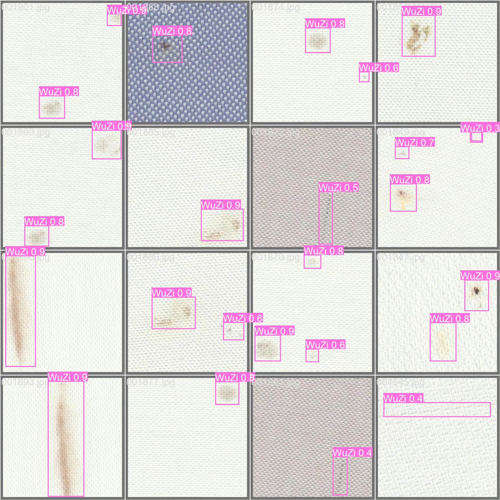
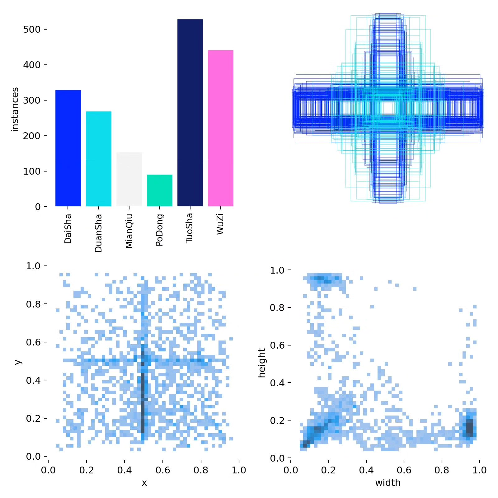
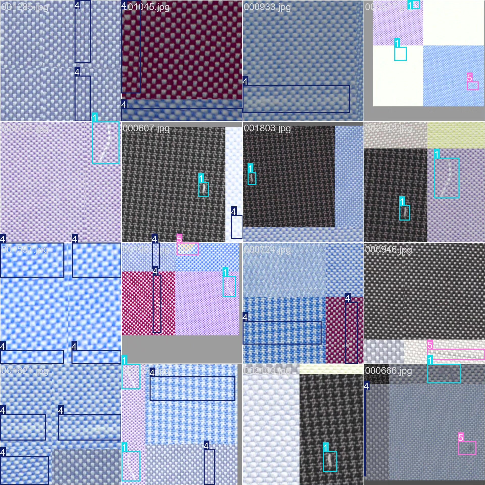

# Based on YOLOv8 deep learning for the detection of fabric defects (YOLOv8+Y)

## Body

This project utilizes the advanced YOLOv8 (You Only Look Once version 8) object detection algorithm to develop a high-efficiency and precise automatic fabric defect detection system. The system is specifically designed for detecting six common types of fabric defects in the textile industry, including: DaiSha (thread breakage), DuanSha (breakage of threads), MianQiu (cotton ball), PoDong (holes), TuoSha (delamination), and WuZi (dirt). The project uses a professional collected fabric defect dataset for training and optimization, with a training set of 1,650 images and a validation set of 467 images, ensuring that the model has industrial-grade detection accuracy.

The company's products have obtained YOLO official commercial license certification.

We provide after-sales service.

After payment, we will provide WeChat IDs for instant questions and answers.

Environment configuration: We will provide an instructional tutorial on environment configuration, and WeChat will provide答疑.

Remote installation service: If you need remote configuration, an additional fee of 69 is required, and if the configuration fails, all fees will be refunded (only the installation fee is refundable for older computers).

Retraining dataset: After setting up the environment, you can train on your own computer. If you need us to retrain, just pay 69 plus computing power fees (2.5 yuan/hour).

Full after-sales service

## Images

## Payment

Here is a pay link on Stripe ( https://buy.stripe.com/3cs8yP7sY87d0vu9AB ). Please contact me lonlonago@foxmail.com after funding $89, and I will send you a complete data files , thank you!

